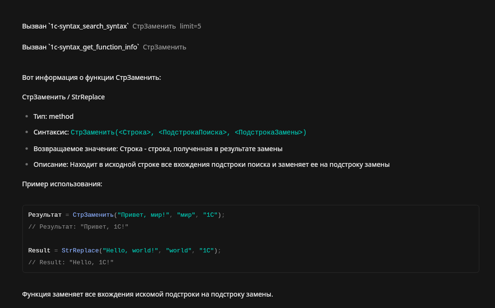

# 1C Syntax MCP Server

MCP-сервер для проверки синтаксиса 1С:Предприятие с автоматической инициализацией.

## Описание

Этот MCP-сервер предоставляет инструменты для работы с синтаксисом 1С:
- Поиск функций и методов по имени (русский/английский)
- Получение детальной информации о функциях
- Автодополнение по частичному имени
- Валидация синтаксиса вызовов функций

## Навык 1С (1cskills)

В репозитории включён навык **1cskills** — набор правил и рекомендаций для AI-ассистентов при работе с кодом на языке 1С. Навык описывает:

- Обязательный алгоритм проверки синтаксиса через MCP
- Контекст выполнения и директивы (`&НаКлиенте`, `&НаСервере` и т.д.)
- Структуру областей (Regions) для модулей объектов, менеджеров, форм и общих модулей
- Структуру файлов проекта (XML-дамп конфигурации)
- Библиотеку стандартных подсистем (БСП) и типовые паттерны
- Именование переменных, документирование кода, пометки изменений
- Язык запросов 1С (ВЫБРАТЬ, соединения, агрегатные функции, временные таблицы и др.)
- Регулярные выражения в 1С

### Установка навыка

Скопируйте навык в директорию навыков вашего AI-ассистента:

**OpenCode:**
```bash
# Windows
mkdir "%APPDATA%\opencode\skills\1cskills"
copy skills\1cskills\SKILL.md "%APPDATA%\opencode\skills\1cskills\SKILL.md"

# Linux/Mac
mkdir -p ~/.config/opencode/skills/1cskills
cp skills/1cskills/SKILL.md ~/.config/opencode/skills/1cskills/SKILL.md
```

Навык автоматически активируется при работе с файлами `.bsl` и `.os`.

## Особенности

При первом запуске сервер **автоматически**:
1. Находит последнюю установленную версию 1С (8.3.x или 8.5.x)
2. Извлекает файл `shcntx_ru.hbk` с документацией по синтаксису
3. Распаковывает его с помощью 7z (ZIP архив, ~52000 файлов)
4. Парсит HTML файлы и строит JSON индекс (~24MB)
5. Запускается с готовым индексом

Весь процесс занимает около 1-2 минут при первом запуске.

Если индекс уже существует (`syntax_tree.json`), сервер сразу запускается с ним (за 1-2 секунды).

## Установка

### 1. Создать виртуальное окружение

```bash
cd 1c-syntax-mcp
python -m venv venv
venv\Scripts\activate  # Windows
# или
source venv/bin/activate  # Linux/Mac
```

### 2. Установить зависимости

```bash
pip install mcp
```

Также требуется 7z для распаковки .hbk файлов:

**Windows:** Скачайте и установите с https://www.7-zip.org/ (добавьте в PATH или установите в стандартную директорию `C:\Program Files\7-Zip\`)

**Linux:**
```bash
sudo apt install p7zip-full  # Debian/Ubuntu
# или
sudo yum install p7zip       # RHEL/CentOS
```

### 3. Настроить OpenCode

Добавьте в `%APPDATA%\opencode\opencode.jsonc` (Windows) или `~/.config/opencode/opencode.jsonc` (Linux/Mac):

**Windows:**
```json
{
  "mcp": {
    "1c-syntax": {
      "type": "local",
      "command": ["C:\\Users\\<username>\\1c-syntax-mcp\\venv\\Scripts\\python.exe", "C:\\Users\\<username>\\1c-syntax-mcp\\server.py"],
      "enabled": true
    }
  }
}
```

**Linux/Mac:**
```json
{
  "mcp": {
    "1c-syntax": {
      "type": "local",
      "command": ["~/1c-syntax-mcp/venv/bin/python", "~/1c-syntax-mcp/server.py"],
      "enabled": true
    }
  }
}
```

### 4. Проверить подключение

```bash
opencode mcp list
```

Вы должны увидеть `1c-syntax` в списке подключенных серверов.

При первом запуске сервер автоматически найдет, распакует и проиндексирует документацию из установленной 1С (занимает 1-2 минуты).

## Использование

### Поиск функций

```
use 1c-syntax to search for СтрДлина
```

### Получить информацию о функции

```
use 1c-syntax to get info about СтрДлина
```

### Автодополнение

```
use 1c-syntax to suggest completions for Стр
```

### Валидация синтаксиса

```
use 1c-syntax to validate: СтрДлина("текст")
```

## Доступные инструменты

### search_syntax
Поиск функций, методов или объектов 1С по имени.

**Параметры:**
- `query` (string, обязательный) - имя для поиска
- `limit` (number, опциональный) - максимум результатов (по умолчанию 10)

**Пример:**
```json
{
  "query": "СтрДлина",
  "limit": 5
}
```

### get_function_info
Получить детальную информацию о функции или методе.

**Параметры:**
- `name` (string, обязательный) - точное имя функции

**Пример:**
```json
{
  "name": "СтрДлина"
}
```


### suggest_completion
Предложить автодополнение по частичному имени.

**Параметры:**
- `prefix` (string, обязательный) - начало имени функции
- `limit` (number, опциональный) - максимум предложений (по умолчанию 10)

**Пример:**
```json
{
  "prefix": "Стр",
  "limit": 10
}
```

### validate_syntax
Проверить корректность синтаксиса вызова функции.

**Параметры:**
- `code` (string, обязательный) - код для проверки

**Пример:**
```json
{
  "code": "СтрДлина(\"текст\")"
}
```

## Структура проекта

```
1c-syntax-mcp/
├── server.py              # Основной файл MCP-сервера с автоинициализацией
├── syntax_tree.json       # Индекс синтаксиса (создается автоматически)
├── extracted_syntax/      # Распакованная документация (создается автоматически)
├── venv/                  # Виртуальное окружение Python
└── README.md              # Этот файл
```

## Технические детали

- **Язык:** Python 3
- **Библиотеки:** mcp (Model Context Protocol)
- **Внешние зависимости:** 7z (для распаковки .hbk файлов)
- **Поддержка версий 1С:** 8.3.x, 8.5.x
- **Поддержка языков:** Русский и английский
- **Источник данных:** shcntx_ru.hbk из установленной платформы 1С
- **Поддержка платформ:** Windows, Linux, macOS

## Troubleshooting

### Сервер не запускается

Проверьте, что:
1. Виртуальное окружение активировано
2. Библиотека mcp установлена: `pip list | grep mcp`
3. Файл `syntax_tree.json` существует в директории проекта
4. Установлен 7z: `7z --help` (Windows) или `which 7z` (Linux)

### Не найдена версия 1С

Сервер ищет установки в:

**Linux:**
- `/opt/1cv8/x86_64/`
- `/opt/1C/v8.3/x86_64/`
- `/opt/1C/v8.5/x86_64/`

**Windows:**
- `C:\Program Files\1cv8\`
- `C:\Program Files (x86)\1cv8\`
- `C:\Program Files\1C\1CE\1cv8\`

Убедитесь, что платформа 1С установлена в одном из этих каталогов.

### Файл shcntx_ru.hbk не найден

**Linux:**
```bash
find /opt -name "shcntx_ru.hbk" 2>/dev/null
```

**Windows:**
```cmd
dir "C:\Program Files\1cv8" /s /b | findstr shcntx_ru.hbk
```

Если файл отсутствует, возможно, установлена неполная версия платформы 1С.

### Ошибка при распаковке

Убедитесь, что установлен 7z:
```bash
7z --help
```

**Windows:** Скачайте с https://www.7-zip.org/

**Linux:**
```bash
sudo apt install p7zip-full
```

## Лицензия

MIT

## Автор

Создано с помощью OpenCode
